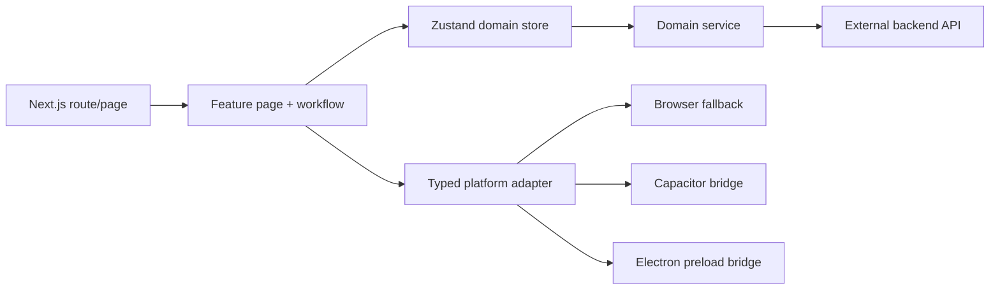

# การปรับโครงสร้าง Yummy Go ตาม Next.js 16

วันที่อนุมัติแนวทาง: 2026-07-19

## 1. บทสรุป

โปรเจกต์ Yummy Go จะปรับโครงสร้างแบบ incremental capability slices โดยรักษาพฤติกรรมที่ใช้งานจริงและ backend contract เดิมไว้ทุกช่วง ไม่ทำ clean-slate rewrite และไม่ย้ายไฟล์เพียงเพื่อให้ directory ดูใหม่ การย้าย แยก รวม หรือเปลี่ยนชื่อจะเกิดขึ้นเมื่อมีหลักฐานว่าแก้ ownership, duplication, bundle boundary, testability, accessibility หรือความเสี่ยงในการดูแลระยะยาวได้จริง

Next.js 16 เป็นเกณฑ์สูงสุดเมื่อขัดกับ `CLAUDE.md` หรือ `AGENTS.md` ส่วนกติกาอื่นของ repository ยังคงใช้ ได้แก่ route files ต้องบาง, data access ผ่าน store/service, Zustand เป็น state manager หลัก, shadcn/ui เป็น UI primitive หลัก, รองรับ light/dark mode และใช้ `AlertDialog` สำหรับ destructive actions

ระบบ production เป้าหมายมีสามแบบ:

- Web ใช้ Next.js 16 SSR บน Node.js
- Electron รัน packaged local Next.js standalone server จาก physical resources นอก ASAR
- Capacitor Android เป็น online production shell ที่โหลด Web SSR จาก `https://yummy-go.com`

หากภายหลังมีข้อกำหนด offline สำหรับ Capacitor จะทำเป็น delivery profile แยก ไม่บังคับ Web SSR และ Electron ให้เปลี่ยนเป็น static export พร้อมกัน

## 2. หลักฐานเริ่มต้น

สถานะที่ตรวจเมื่อ 2026-07-19:

- `next@16.2.10`, `react@19.2.7`, `react-dom@19.2.7` และ `eslint-config-next@16.2.10`
- `npm run typecheck` ผ่าน
- Vitest ผ่าน 91 test files และ 572 tests
- `npm run build` ผ่านด้วย Turbopack และทุก route เป็น dynamic SSR เพราะ root layout ใช้ `await cookies()`
- ESLint ของ tracked `src` เหลือ 56 errors:
  - 39 `react-hooks/set-state-in-effect`
  - 10 `react-hooks/preserve-manual-memoization`
  - 5 `react-hooks/immutability`
  - 1 `react-hooks/refs`
  - 1 `react-hooks/use-memo`
- branch `feature-24` มี refactor เดิม 27 commits และต้องถือเป็นฐานงาน ไม่ย้อนหรือเขียนทับ
- ไฟล์ untracked ต่อไปนี้มีอยู่ก่อน design นี้และอยู่นอก scope จนกว่าเจ้าของงานจะสั่งเป็นอย่างอื่น:
  - `.agents/skills/yummy-go-electron/`
  - `.agents/skills/yummy-go-printing/`
  - `src/features/pos/order-customer/zz-lint-probe.ts`
  - `src/features/public-pos/order/hooks/zz-lint-probe.ts`

## 3. เป้าหมาย

1. ทำให้ source สอดคล้องกับ Next.js 16 และ React 19.2 โดยไม่มี tracked ESLint error
2. ทำให้โครงสร้างอธิบาย ownership ได้ชัด: หนึ่ง capability มี owner เดียวและ interface ที่ตรวจสอบได้
3. รวม business logic และ UI patterns ที่ซ้ำจริงให้แก้ไขจากจุดเดียว
4. ลดไฟล์ที่รวมหลาย concern จน review, test หรือ bundle แยกไม่ได้
5. รักษา route, API, i18n, printing, Electron IPC และ Capacitor behavior
6. ทำให้ error/loading/empty/not-found states จบได้ครบและเข้าถึงได้ด้วย keyboard/screen reader
7. ทำให้ Web, Electron และ Capacitor มี delivery contract ที่ระบุและตรวจสอบได้
8. สร้าง quality gates ที่พิสูจน์ architecture และ behavior ได้ ไม่พึ่งความรู้สึกว่าโค้ดดูสะอาด

## 4. สิ่งที่ไม่ทำ

- ไม่เปลี่ยน backend endpoints, query keys หรือ payload fields
- ไม่เปลี่ยน `unite_*` เป็น `unit_*` ที่ backend contract boundary
- ไม่เปลี่ยน route URL แบบ breaking; route migration ต้องมี redirect หรือ compatibility path
- ไม่เพิ่ม UI framework, state manager หรือ data-fetching framework ที่ซ้ำกับ shadcn/ui, Tailwind และ Zustand
- ไม่แปลง data layer ทั้งหมดเป็น Server Actions เพราะ auth/session, external backend และ platform bridge เป็น client-owned จริง
- ไม่สร้าง generic mega-table, mega-form หรือ schema abstraction ที่บังคับทุก domain ให้มี shape เดียวกัน
- ไม่ทำ visual redesign พร้อม structural refactor เว้นแต่แก้ accessibility, state clarity หรือ design-system inconsistency ที่ยืนยันแล้ว
- ไม่ bulk rename locale keys, Electron channels, route segments หรือ backend fields
- ไม่ใช้ browser automation เมื่อ static evidence และ focused CLI validation พิสูจน์ผลได้เพียงพอ

## 5. แนวทางที่เลือก

### 5.1 Incremental capability slices

แต่ละ slice ต้อง:

1. ระบุ behavior และ contract ที่ต้องรักษา
2. เพิ่มหรือยืนยัน characterization tests ก่อนย้าย logic ที่เสี่ยง
3. ย้าย owner หรือสกัด interface ทีละขอบเขต
4. ใช้ compatibility re-export หรือ redirect ชั่วคราวเมื่อมี consumers หลายจุด
5. migrate consumers ไป direct import
6. ลบ compatibility layer เมื่อค้นหาแล้วยืนยันว่าไม่มี consumer
7. ผ่าน focused gates ของ slice และ broad gates ที่เหมาะกับความเสี่ยง
8. commit เป็นหน่วยที่ rollback และ review ได้

### 5.2 เหตุผลที่ไม่เลือกทางอื่น

- การย้ายทั้ง domain พร้อมกันลดเวลาเห็น directory ใหม่ แต่ทำให้ route, locale, printing และ platform integration เปลี่ยนพร้อมกันจนหาต้นเหตุ regression ยาก
- clean-slate rewrite สร้าง implementation สองชุดและทำให้ business-rule drift มากขึ้น ซึ่งขัดกับเป้าหมาย consolidation

## 6. Target architecture

```text
src/
  app/                         # thin routes, layouts, metadata, boundaries
  features/
    <domain>/
      <capability>/
        <capability>-page.tsx
        <capability>-view.tsx
        use-<capability>-workflow.ts
        <capability>-model.ts
        <specific-purpose>.ts
      shared/                  # reuse ภายใน domain เท่านั้น
  components/
    ui/                        # shadcn-style primitives
    common/                    # domain-agnostic composed UI
    layout/                    # application shell primitives
  stores/
    <domain>/                  # state/actions แยกตาม capability
  services/
    <domain>/                  # API transport, API models, normalizers
    shared/
  platform/
    browser/                   # renderer/browser transport adapters
    capacitor/                 # Capacitor renderer adapters
    electron/                  # typed renderer-side Electron adapters
  lib/                         # pure cross-domain utilities
  config/                      # static application configuration
  types/                       # global ambient/cross-domain declarations only
```

โครงสร้างนี้เป็น target ไม่ใช่คำสั่งให้ย้ายทุกไฟล์ทันที Directory จะถูกสร้างเมื่อ slice แรกมี code ที่เป็นเจ้าของจริง

### 6.1 Ownership rules

- `src/app`: route composition, metadata, layouts, route boundaries และ async Next.js request APIs เท่านั้น
- `src/features`: UI, screen workflow และ presentation logic ของ domain
- `src/stores`: Zustand state, async actions, request/session guards และ orchestration ไป service
- `src/services`: backend transport, request/response types และ normalization ที่ติดกับ API contract
- `src/components/ui`: primitives ที่ไม่รู้จัก business domain
- `src/components/common`: composed UI ที่ reuse ข้าม domain โดยรับข้อมูลผ่าน props/interfaces
- `src/lib`: pure logic ที่ไม่มี React, Zustand, service หรือ platform dependency
- `src/platform`: adapter ที่ซ่อน browser/Capacitor/Electron implementation จาก feature consumers

ห้าม `store -> feature` หรือ `service -> store/feature` dependency ทุกชนิด รวมถึง type-only imports หาก type นั้นเป็น domain contract ที่ควรอยู่ใน service/domain model

### 6.2 Import rules

- ใช้ direct imports เป็นค่าเริ่มต้นเพื่อลด broad module graphs
- barrel files อนุญาตเฉพาะ public boundary ที่มี consumers จริงและไม่ทำให้ client bundle import capability ที่ไม่ใช้
- compatibility barrels ต้องมี removal condition ชัดเจนและไม่คงไว้ถาวร
- cross-feature imports ต้องย้าย capability ไป owner ที่เป็นกลางเมื่อมี consumer ข้าม domain มากกว่าหนึ่งกลุ่ม

## 7. Next.js 16 และ rendering boundaries

### 7.1 Server Components

route pages และ layouts ยังคงเป็น Server Components เว้นแต่มีหลักฐานว่าต้องเป็น client boundary โดยตรง ใช้สำหรับ metadata, `params`, `searchParams`, `cookies()` และ composition ของ feature entrypoint

`params`, `searchParams`, `cookies()` และ `headers()` ต้องใช้ async APIs ตาม Next.js 16 เท่านั้น Route ที่ใช้ `searchParams` จะยอมรับว่าเป็น dynamic SSR และไม่แสร้งว่าเป็น static export

### 7.2 Client Components

Client Components เป็น owner ของ:

- persisted Zustand session/state
- interactive POS workflows
- i18next runtime switching
- browser storage and BroadcastChannel
- Socket.IO
- Electron preload bridge
- Capacitor plugins
- printer device execution

การย้าย client logic ไป server ทำเมื่อช่วยลด bundle หรือ waterfall ได้จริงและไม่ทำลาย auth/platform contract

### 7.3 Suspense และ error boundaries

- `useSearchParams` consumers ต้องอยู่ใต้ meaningful Suspense fallback
- เพิ่ม `global-error.tsx` เพื่อครอบ root layout failures
- `error.tsx` ต้องให้ Retry และ recovery path ที่เหมาะกับ route
- route loading fallback ต้องใช้ skeleton ที่รักษา layout แทน spinner เปล่าหากหน้ามีโครงสร้างที่คาดการณ์ได้

### 7.4 Image, font และ scripts

- ใช้ `next/image`; HTML strings สำหรับ print window เป็นข้อยกเว้นที่แยกจาก React tree
- เปลี่ยน deprecated `Image priority` เป็น Next.js 16 loading API ที่เหมาะกับ LCP ของแต่ละภาพ
- ใช้ `next/font` จาก root/shared font module
- inline `next/script` ต้องมี `id`; `beforeInteractive` ใช้เฉพาะ root layout requirement

เอกสารอ้างอิงหลัก:

- https://nextjs.org/docs/app/guides/upgrading/version-16
- https://nextjs.org/docs/app/getting-started/project-structure
- https://nextjs.org/docs/app/guides/static-exports
- https://nextjs.org/docs/app/guides/package-bundling

## 8. Component architecture และ reuse

### 8.1 ระดับของ component

1. Primitive: `Button`, `Input`, `Dialog`, `AlertDialog`, `Table`
2. Domain-agnostic composition: `SearchInput`, `StatusBadge`, `LoadingState`, `EmptyState`, pagination และ filter shell
3. Domain composition: report results, product form section, POS cart surface
4. Screen orchestration: `<Capability>Page` และ `use<Capability>Workflow`

Component ระดับบนห้ามไหลกลับลงไปเป็น dependency ของระดับล่าง

### 8.2 Composition over boolean modes

- หลีกเลี่ยง boolean props จำนวนมากเพื่อเปลี่ยน layout/behavior
- ใช้ explicit variants หรือ children slots เมื่อแต่ละ mode มี markup/semantics ต่างกัน
- shared component ต้องรับ generic state interface แต่ไม่รู้จัก Zustand store ใดโดยตรง
- ไม่บังคับ desktop table, mobile cards, grouped rows และ print layout ให้ใช้ component implementation เดียวกัน หาก semantics ต่างกัน

### 8.3 Report UI

สกัดเฉพาะโครงที่ซ้ำจริง:

- `ReportResultsCard`
- `ReportSelectionToolbar`
- `ReportTableState`
- filter shell และ mobile filter sheet
- export status/info
- pagination

แต่ละ report ยังคงเป็นเจ้าของ columns, row semantics, summary, payload mapping และ export format ของตนเอง

### 8.4 Settings UI

ใช้ `createCrudListStore + OptionSettingsPage` เป็น canonical path สำหรับ simple option domains ส่วน domain ที่มี workflow เฉพาะ เช่น branch, location, user และ table ใช้ typed page composition ของตน แต่ reuse shell, fields และ destructive confirmation เดียวกัน

### 8.5 Large components

ไฟล์ production `.ts/.tsx` ที่เกิน 600 บรรทัดต้องถูกประเมิน ไฟล์ที่รวมหลาย concern จะ split ตาม visual section, workflow หรือ pure model ส่วน test fixtures, generated data, print template หรือ geometry data อาจเกินได้เมื่อมีเหตุผลชัดและการแยกทำให้อ่านยากกว่าเดิม

## 9. Data flow และ state ownership



### 9.1 Request context

`store_uuid_fk`, `branch_uuid_fk`, language, request id และ session identity ต้องส่งอย่างชัดเจนจาก owner ห้ามเก็บ mutable request scope ระดับ service module เช่น `explicitStoreUuid`

### 9.2 Branch/reference ownership

- เลือก owner เดียวสำหรับ selected store/branch
- reference data ใช้ typed slices หรือ typed capabilities ไม่เก็บทุก entity เป็น `ApiEntity[]` แล้ว cast ใน consumers
- async actions ต้องมี request/session guard เพื่อป้องกัน late writes หลัง logout, branch switch หรือ reset

### 9.3 Report stores

แยก store ต่อ report capability เพื่อให้ source, tests และ client graph แยกได้ `report-store.ts` ใช้เป็น compatibility facade ชั่วคราวระหว่าง migration และต้องถูกลบเมื่อ consumers ย้ายครบ

all-page export loops ใช้ tested shared iterator ที่รับ fetch-page function, pagination metadata และ cancellation/request guard โดยไม่รู้จัก report payload

### 9.4 POS business rules

ก่อนรวม staff/public POS ต้องมี fixture matrix ครอบ:

- detail availability
- stock fallback fields
- option sorting/default selection
- promotion/set pricing
- direct-add eligibility
- default/min/max quantity
- order payload normalization

เฉพาะ invariant ที่ต้องเหมือนกันจึงย้ายไป pure shared domain module ความต่างที่เป็น business rule จริงอยู่ใน explicit staff/public policy adapter

## 10. Error handling และ async state

### 10.1 State model

ทุก data-driven screen ต้องมี terminal states ที่แยกได้:

- `idle`
- `loading`
- `ready`
- `empty`
- `notFound`
- `error`
- `saving` หรือ `submitting` เมื่อมี mutation

ไม่ใช้ค่าหลาย boolean ที่สร้างสถานะขัดกัน และไม่แสดง skeleton ต่อไปเมื่อ request จบด้วย error/not-found

### 10.2 Service/store/component responsibilities

- service normalize backend failure เป็น `ServiceError`
- store เก็บ async state, request identity และ recovery action
- feature เลือก UI state และข้อความที่ localized
- route error boundary ใช้กับ unexpected render/runtime failures ไม่แทน expected API errors

### 10.3 Confirmations และ unsaved work

- destructive action ใช้ `AlertDialog`
- flow ที่ต้องกรอกเหตุผลสามารถใช้ input step ก่อน final `AlertDialog`
- product, printer และ permission forms ต้องเตือนก่อนออกเมื่อ dirty
- confirmation ต้องไม่ซ้ำซ้อนจนเพิ่ม friction โดยไม่มีความเสี่ยงรองรับ

## 11. Accessibility และ theme policy

- label ต้องผูก control ด้วย `htmlFor/id` หรือ accessible name ที่เทียบเท่า
- toggle/selected controls ใช้ `aria-pressed`, `aria-selected` หรือ native semantics ไม่ใช้สีอย่างเดียว
- icon-only buttons ต้องมี accessible name
- mobile dialogs/menus ต้องจัดการ focus, Escape และคืน focus
- touch targets สำคัญมีขนาดอย่างน้อย 44 CSS pixels เมื่อ layout อนุญาต
- inline spinner ที่มีข้อความข้างกันเป็น decorative; standalone spinner ต้องรับ localized label
- success/error announcements ใช้ `role=status`, `aria-live` หรือ alert semantics ตามระดับความสำคัญ

Theme zones:

- protected application UI รองรับ light/dark ผ่าน semantic tokens
- login เป็น explicit fixed-light zone
- landing และ customer display เป็น explicit branded/fixed zones
- report/receipt print surfaces คงพื้นขาวและ print color policy
- `/policy` ต้องรองรับ light/dark หรือประกาศ fixed zone อย่างชัดเจน ไม่ปล่อยเป็น accidental hardcoded palette

## 12. Platform delivery

### 12.1 Web SSR

- deployment ใช้ Node.js `>=20.9.0` ตาม Next.js 16 floor และ pin ใน repository/CI
- workflow ต้อง fail ก่อน install/build หาก Node ต่ำกว่าที่รองรับ
- SSR smoke ครอบ `/login`, `/pos`, representative protected report และ redirects

### 12.2 Electron

- ใช้ Next.js standalone output เป็น physical `extraResources` นอก ASAR
- production launcher ใช้ path จาก `process.resourcesPath` ไม่เรียก `node_modules/.bin/next`
- กำหนด writable cache/temp path ที่ Electron process เข้าถึงได้
- คง `contextIsolation: true`, `nodeIntegration: false` และ typed narrow preload API
- ทดสอบ unpacked executable และ NSIS install จริง รวม startup, customer display, image, restart และ child-process shutdown

### 12.3 Capacitor

- production `server.url` เป็น deliberate online-shell contract และต้องมี UX เมื่อ network/server ใช้งานไม่ได้
- Android System WebView minimum คือ Chromium `111` ตาม browser floor ของ Next.js 16
- `webDir` ต้องไม่สื่อว่า production bundle เป็น offline asset หากไม่มี `out/`; config/docs ต้องอธิบายความจริง
- native debugging ปิดใน production และ platform-specific printing ยังใช้ adapter เดิม

## 13. Migration program

งานใหญ่เกินหนึ่ง implementation plan จึงแบ่งเป็น subprojects ที่ deploy/test ได้อิสระ แต่ทุก subproject ต้องสอดคล้องกับ design นี้

### Phase 1: Project contract และ Next.js 16 platform foundation

- เตรียม proposal เพื่อปรับ `AGENTS.md`/`CLAUDE.md` จาก Next.js 15/static-export claim ให้ตรง SSR contract แล้ว apply หลังได้รับอนุมัติแยกตาม Hermes draft/approve workflow เท่านั้น โดยรักษา Hermes block แบบ byte-for-byte
- pin Node runtime และเพิ่ม validation
- เพิ่ม root error boundary, meaningful Suspense fallbacks และแก้ deprecated image props
- แก้ Electron standalone packaging และระบุ Capacitor online contract

### Phase 2: React 19/Compiler correctness

- ปิด 56 tracked lint errors แยกตาม domain
- แยก derived state, event-driven reset และ external synchronization ให้ถูก semantics
- ห้าม disable lint rule เพื่อทำให้ gate ผ่าน
- เพิ่ม focused regression tests เมื่อ effect เดิมมี business behavior

### Phase 3: Terminal states และ accessibility

- product edit loading/error/not-found/retry
- destructive cancel confirmation
- unsaved-change protection
- labels, toggle semantics, focus management, spinner และ landing accessibility

### Phase 4: Report modularization

- แยก store ต่อ report
- สกัด all-page iterator
- สกัด composable report results/filter primitives
- เริ่มจาก capability dependency ต่ำ แล้วจบที่ daily-sales ซึ่งซับซ้อนที่สุด

### Phase 5: POS shared domain rules

- เพิ่ม staff/public characterization matrix
- สกัด shared invariants
- รักษา explicit policy differences
- split large POS/public POS utilities ตาม capability

### Phase 6: Settings, branch และ reference state

- ทำ settings CRUD ให้เหลือ canonical paths
- ตัด store-to-feature type dependency
- ย้าย mutable scope ออกจาก service
- typed reference slices และ owner เดียวสำหรับ selection

### Phase 7: Shared capability ownership และ large-file split

- ย้าย invoice/receipt window, export primitives และ shared media/form capabilities ไป owner ที่เป็นกลาง
- split `AppShell`, `LoadingState`, report components, printer pages และ product workflows
- migrate manual search/status/loading patterns ที่ semantics ตรงกับ shared component

### Phase 8: Naming และ compatibility cleanup

- เปลี่ยน internal names ที่กำกวมโดยไม่เปลี่ยน backend contract
- ลบ dead barrels และ compatibility re-exports หลัง consumers เป็นศูนย์
- ตรวจ route strings, menu, breadcrumbs, QR links, i18n และ platform integrations ก่อน rename ทุกครั้ง

### Phase 9: Completion audit

- ตรวจ requirement-by-requirement เทียบ objective และ design
- ตรวจ source inventory, dependency graph, duplicate hotspots และ file-size exceptions
- รัน full quality gates และ platform smoke tests
- ห้ามประกาศเสร็จจาก narrow tests หรือการไม่พบ error เพียงอย่างเดียว

## 14. Testing strategy

### 14.1 Test pyramid

- pure unit tests: normalizers, pricing, selection, payload mapping, pagination และ compatibility helpers
- store tests: request/session guards, reset behavior, async terminal states และ stale-response protection
- architecture guards: thin routes, layer imports, destructive modal policy, accessible icon buttons และ compatibility boundaries
- targeted component tests: เฉพาะ interaction/focus/error recovery ที่ static tests พิสูจน์ไม่ได้
- platform smoke: Electron packaged runtime และ Capacitor Android build/device contract

### 14.2 Gates ต่อ slice

อย่างน้อย:

```powershell
npx eslint <changed-source-paths>
npx tsc -p tsconfig.json --noEmit --incremental false
npx vitest run <focused-test-files>
git diff --check
```

เพิ่ม `npm run build`, `npm run electron:build`, Android build หรือ packaged smoke ตาม blast radius

### 14.3 Full gates

```powershell
npm run lint
npm run typecheck
npm test
npm run build
npm run electron:build
```

Electron packaging และ Android gates เป็น required evidence เมื่อ phase ที่เกี่ยวข้องเสร็จ ไม่ใช้ successful Web build แทน platform verification

## 15. Definition of done

โปรแกรม refactor ถือว่าเสร็จเมื่อหลักฐานปัจจุบันพิสูจน์ครบทุกข้อ:

1. tracked ESLint errors และ warnings ที่ policy ห้ามเป็นศูนย์ โดยไม่มี suppression เพื่อหลบ rule
2. TypeScript, full Vitest และ Next.js production build ผ่าน
3. Electron main/preload compile ผ่าน และ packaged unpacked/NSIS smoke ผ่านตาม checklist
4. Capacitor Android sync/build ผ่าน และ device/WebView support contract ถูกบันทึก/ตรวจสอบ
5. route URLs, redirects, API fields, i18n keys, printing contracts และ IPC contracts ไม่ถดถอย
6. ไม่มี runtime data access ข้าม store/service layer
7. ไม่มี service module mutable request scope
8. report stores และ report UI shared layer แยก capability ได้จริง
9. staff/public POS shared invariants มี owner เดียวและ policy differences มี tests
10. settings CRUD ไม่มี architecture ซ้ำที่ไม่จำเป็น
11. cross-domain capabilities อยู่ที่ owner เป็นกลางหรือมีเหตุผล exception ชัดเจน
12. production source files ที่รวมหลาย concern ถูก split; file-size exceptions ถูกบันทึกพร้อมเหตุผล
13. loading/error/empty/not-found states ของ data-heavy screens จบได้ครบ
14. destructive, keyboard, focus, accessible-name, toggle และ theme checks ผ่านใน surfaces ที่แก้
15. compatibility exports/redirects ชั่วคราวถูกลบหรือมี consumer/เหตุผลที่พิสูจน์ได้
16. completion audit เทียบ objective ทุกข้อเสร็จและไม่มีหลักฐานที่ยัง missing หรือ indirect

## 16. ความเสี่ยงและการควบคุม

| ความเสี่ยง | การควบคุม |
| --- | --- |
| Business behavior เปลี่ยนระหว่างรวม logic | Characterization tests และ policy adapters ก่อนย้าย |
| Bundle โตจาก shared barrels | Direct imports และ bundle analysis ต่อ capability |
| Rename ทำลาย URL/API/i18n | Contract inventory, compatibility layer และ repo-wide search |
| React lint fix ทำให้ async workflow เปลี่ยน | แยก derived/event/external-sync semantics และ focused regression tests |
| Electron Web build ผ่านแต่ package เปิดไม่ได้ | Unpacked/NSIS executable smoke เป็น required gate |
| Capacitor online shell ล่มเมื่อ network หาย | Explicit offline/error UX และ document online contract |
| Generic abstraction ซับซ้อนกว่า duplication | สกัดเฉพาะ pattern ที่มี independent consumers จริงอย่างน้อยสองจุดและ interface คงที่ |
| งานใหญ่ทำให้ review ไม่ได้ | Subproject plans, small commits และ compatibility boundaries |

## 17. ผลลัพธ์ที่คาดหวัง

เมื่อจบโปรแกรม นักพัฒนาต้องสามารถตอบได้ทันทีว่า capability ใดอยู่ที่ไหน, state และ API ใครเป็น owner, shared logic แก้จุดใด, platform ใดใช้ adapter ใด และ test/gate ใดพิสูจน์ behavior นั้น การเปลี่ยน common behavior หนึ่งครั้งต้องสะท้อนทุก consumer ที่ใช้ contract เดียวกัน โดยไม่บังคับ domain ที่ semantics ต่างกันให้เข้า abstraction เดียว
